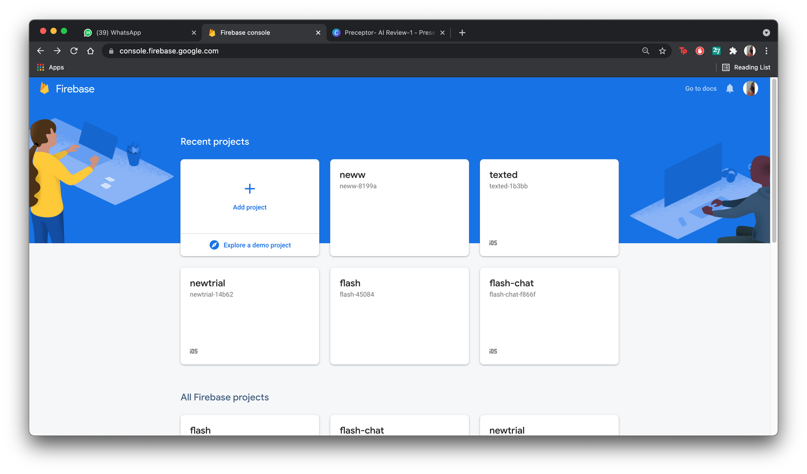
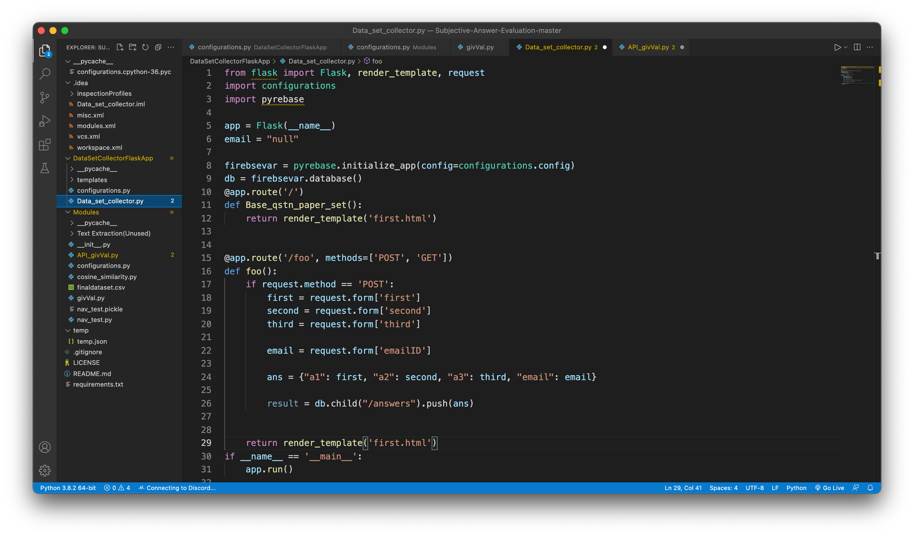
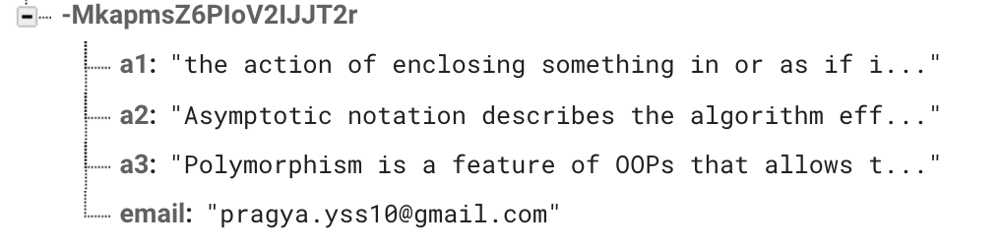

Contents:

- Integrating the frontend part of the online evaluator for fetching answers into the real time database in firebase with the help of flask. 
- Implementing the algorithm that is used to evaluate answers based on 3 parameters
  - `  `Keywords
  - `  `Grammar
  - `  `Question Specific Things (QST)

1) Create a new firebase project in this case named new:

1) Import the given json file into the firebase realtime database of the project:

1) After importing the json:

1) Make a config.py file which would contain details of the project and help in linking the flask code with the database:

1) Code file responsible for fetching data from the webpage to the database:

1) Output upon executing the python file using flaskthus giving us a host address for the web page:

1) Opening the link just generated and giving the answers followed by the email id and then submit:

1) Successful fetching of the data into the firebase database:

1) Run the givVal.py file inside the Modules folder to get output of the evaluated answer:

