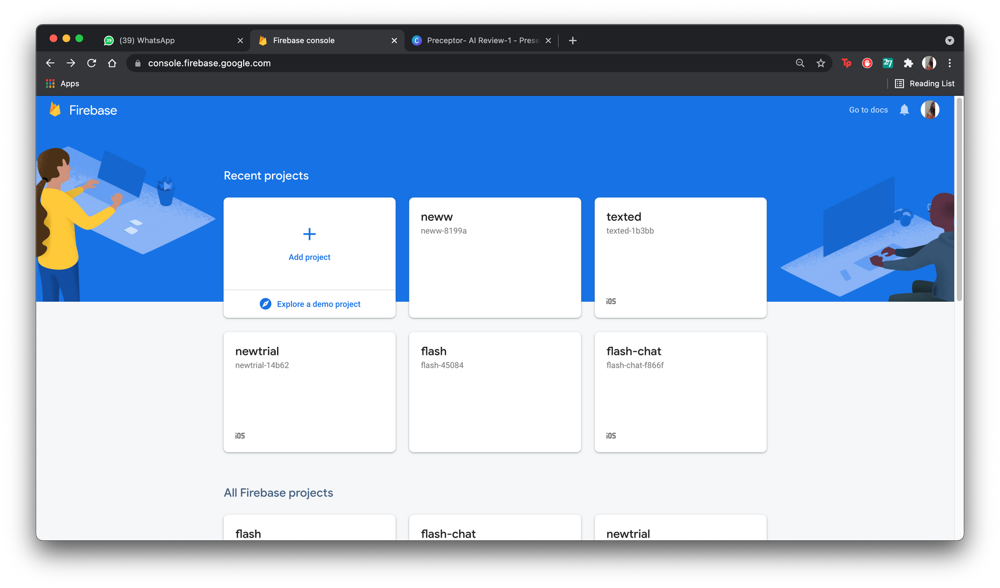
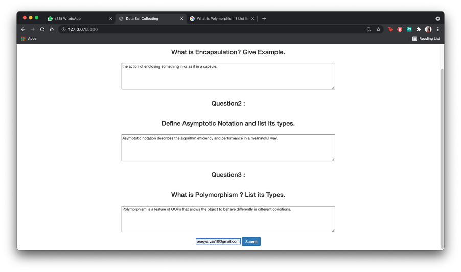
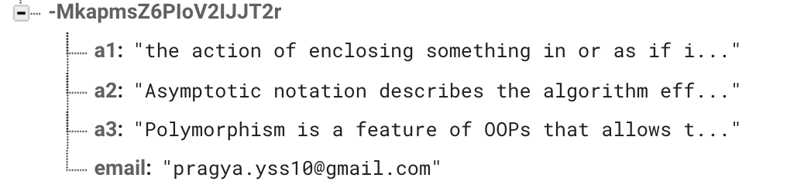

# Contents:

- Integrating the frontend part of the online evaluator for fetching answers into the real time database in firebase with the help of flask. 
- Implementing the algorithm that is used to evaluate answers based on 3 parameters
  - Keywords
  - Grammar
  - Question Specific Things (QST)
 
 

## 1) Create a new firebase project in this case named new:

 
 
 
 
## 2) Import the given json file into the firebase realtime database of the project:

 
 
 
 
## 3) After importing the json:

 
 
 
 
## 4) Make a config.py file which would contain details of the project and help in linking the flask code with the database:

 
  
 
 
 
## 5) Code file responsible for fetching data from the webpage to the database:

 
 
 
 
 
## 6) Output upon executing the python file using flask thus giving us a host address for the web page:

 
 
 
 
## 7) Opening the link just generated and giving the answers followed by the email id and then submit:

 
 
 
 
## 8) Successful fetching of the data into the firebase database:

 
 
 
 
## 9) Run the givVal.py file inside the Modules folder to get output of the evaluated answer:

